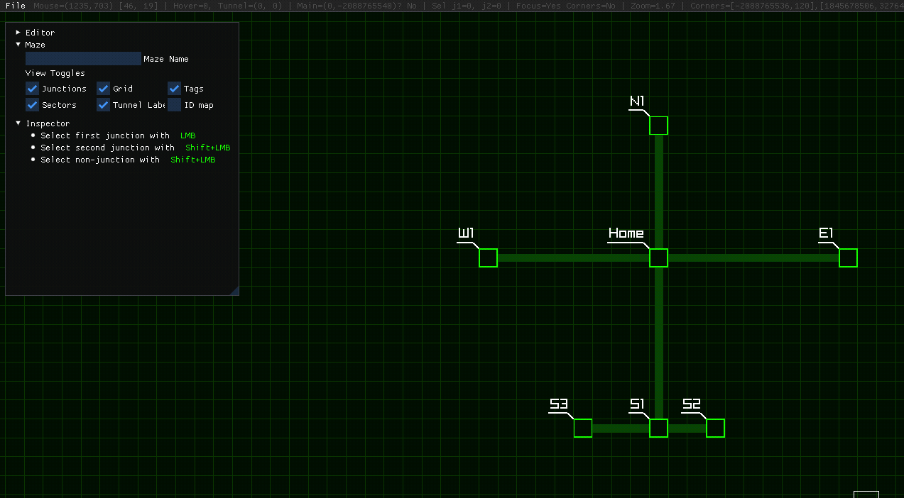
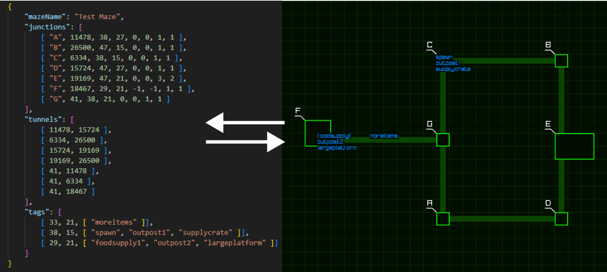

# MazeRunner

This project is still a work in progress for a game I am working on. 
Please refer to the task list below to see what features are currently available.-

## Feature Progress

Core features:
- [x] Junction placement, naming, sizing
- [x] Edge placement
- [x] Tagging of any grid cell with strings
- [x] JSON export/import function
- [ ] File management/Export UI
- [ ] Sector partitioning. Junction naming and coloring by sector.

Extra: 
- [ ] Advanced junction moving features
- [ ] Tag managing and coloring
- [ ] Interactive maze generation
- [ ] Realtime player location visualiser through sockets

## JSON Export

The mazes are loaded to and from readable JSON.

